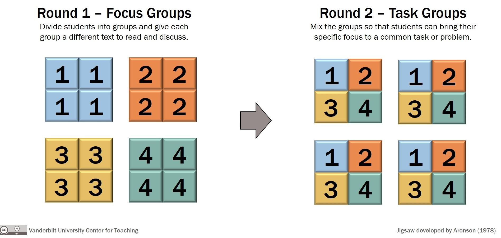

layout: true
<div style="position: absolute;left:20px;bottom:5px;color:black;font-size: 12px;">`r rmarkdown::metadata$author` (Tulane) | `r rmarkdown::metadata$subtitle` | `r format(Sys.time(), '%d %B %Y')`</div>

<!--- `r rmarkdown::metadata$subtitle` | `r format(Sys.time(), '%d %B %Y')`-->

```{r, load_refs, echo=FALSE, cache=FALSE, message=FALSE}
library(RefManageR)
BibOptions(check.entries = FALSE, 
           bib.style = "authoryear", 
           cite.style = 'authoryear', 
           style = "markdown",
           hyperlink = FALSE, 
           dashed = FALSE)
myBib <- ReadBib("assets/example.bib", check = FALSE)
top_icon = function(x) {
  icons::icon_style(
    icons::fontawesome(x),
    position = "fixed", top = 10, right = 10
  )
}
```

```{r setup, include=FALSE}
options(htmltools.dir.version = FALSE)
library(knitr)
opts_chunk$set(
  fig.align="center",  
  fig.height=4, fig.width=6,
  out.width="748px", out.length="520.75px",
  dpi=300, #fig.path='Figs/',
  cache=F#, echo=F, warning=F, message=F
  )
```


```{r, cache=FALSE, message=FALSE, warning=FALSE, include=TRUE, eval=TRUE, results=FALSE, echo=FALSE, tidy.opts = list(width.cutoff = 50), tidy = TRUE}
## Load and install the packages that we'll be using today
if (!require("pacman")) install.packages("pacman")
pacman::p_load(tictoc, parallel, pbapply, future, future.apply, furrr, RhpcBLASctl, memoise, here, foreign, mfx, tidyverse, hrbrthemes, estimatr, ivreg, fixest, sandwich, lmtest, margins, vtable, broom, modelsummary, stargazer, fastDummies, recipes, dummy, gplots, haven, huxtable, kableExtra, gmodels, survey, gtsummary, data.table, tidyfast, dtplyr, microbenchmark, ggpubr, tibble, viridis, wesanderson, censReg, rstatix, srvyr, formatR, sysfonts, showtextdb, showtext, thematic, sampleSelection, RefManageR, DT, googleVis, png, grid, countdown)
# devtools::install_github("thomasp85/patchwork")
remotes::install_github("mitchelloharawild/icons")
remotes::install_github("ROpenSci/bibtex")

# devtools::install_github("ajdamico/lodown")
## My preferred ggplot2 plotting theme (optional)
## https://github.com/hrbrmstr/hrbrthemes
# scale_fill_ipsum()
# scale_color_ipsum()
font_add_google("Fira Sans", "firasans")
font_add_google("Fira Code", "firasans")

showtext_auto()

theme_customs <- theme(
  text = element_text(family = 'firasans', size = 16),
  plot.title.position = 'plot',
  plot.title = element_text(
    face = 'bold', 
    colour = thematic::okabe_ito(8)[6],
    margin = margin(t = 2, r = 0, b = 7, l = 0, unit = "mm")
  ),
)

colors <-  thematic::okabe_ito(5)

# theme_set(theme_minimal() + theme_customs)
theme_set(hrbrthemes::theme_ipsum() + theme_customs)
## Set master directory where all sub-directories are located
mdir <- "/Users/hhadah/Documents/GiT/urban-econ/slides/01-week1/tue"

## Set working directory

# COLOR PALLETES
library(paletteer) 
# paletteer_d("awtools::a_palette")
# paletteer_d("suffrager::CarolMan")

### COLOR BLIND PALLETES
#paletteer_d("colorblindr::OkabeIto")
#paletteer_d("colorblindr::OkabeIto_black")
# paletteer_d("colorBlindness::paletteMartin")
# paletteer_d("colorBlindness::Blue2DarkRed18Steps")
# paletteer_d("colorBlindness::SteppedSequential5Steps")
# paletteer_d("colorBlindness::PairedColor12Steps")
# paletteer_d("colorBlindness::ModifiedSpectralScheme11Steps")
colorBlindness <- paletteer_d("colorBlindness::Blue2Orange12Steps")
cbbPalette <- c("#000000", "#E69F00", "#56B4E9", "#009E73", "#F0E442", "#0072B2", "#D55E00", "#CC79A7")

# scale_colour_paletteer_d("colorBlindness::ModifiedSpectralScheme11Steps", dynamic = FALSE)
# To use for fills, add
  scale_fill_manual(values="colorBlindness::Blue2Orange12Steps")

# To use for line and point colors, add
  scale_colour_manual(values="colorBlindness::Blue2Orange12Steps")
  #<a><button>[Click me](#sources)</button></a>
remotes::install_github("gadenbuie/xaringanExtra")
xaringanExtra::use_scribble() ## Draw on slides. Requires dev version of xaringanExtra.
xaringanExtra::use_xaringan_extra(c("tile_view", "animate_css", "tachyons"))
#install.packages("countdown")
```

```{css, echo=F}
    /* Table width = 100% max-width */

    .remark-slide table{
        width: auto !important; /* Adjusts table width */
    }

    /* Change the background color to white for shaded rows (even rows) */

    .remark-slide thead, .remark-slide tr:nth-child(2n) {
        background-color: white;
    }
    .remark-slide thead, .remark-slide tr:nth-child(n) {
        background-color: white;
    }
```

---
## Jigsaw Activity



---
## Jigsaw Activity

1) First grouping - "Focus Groups" - about 10 minutes

  1. You will be in a groups with those who read the same paper as you. You will discuss your paper to all get on the same page about it. Specially, you will to be able to summarize your paper to your peers who have not read it in the next group, so you want to ensure you can provide a summary. Probably the best way to get on the same page about your reading is to share your summaries that you submitted before class and discuss how you can improve them. 

  2. While in this group, each of you will answer the first set of questions here -> Cluster Jigsaw Questions (Work on During Class Jan 25.)

```{r first-timer, echo=FALSE, message=FALSE}
library(countdown)
countdown(
  minutes = 15, seconds = 0,
  top = 0, # right = "50%",
  play_sound = FALSE
)
```

---
## Jigsaw Activity

2) Second grouping - "Task Groups" - remaining time of about 15 minutes

  1. You will be in groups with those who read a different paper than you.
  1. Briefly introduce yourselves and note which papers you were assigned. In some cases there may be two people who read the same paper. That is fine.
  1. Take turns summarizing your paper to your peers orally in about 4 minutes. Focus on the key "takeaways" (think TL;DR). You can also provide them with the written summary by copy-pasting it into the chat. If there is more than one of you who did the same paper then please collaborate on this. Perhaps one person could give a summary and the second person can add anything that was missed or confirm those points.
  1. While others are summarizing their papers to you, feel free to ask questions to help you better understand the papers.
  1. Your goal will be to learn enough about the other papers such that you can answer the second set of questions here -> Cluster Jigsaw Questions (Work on During Class Jan. 25)
  1. You are free to go once you've submitted your answers.

```{r second-timer, echo=FALSE, message=FALSE}
library(countdown)
countdown(minutes = 25, seconds = 0, top = 0)
```

```{r gen_pdf, include = FALSE, cache = FALSE, eval = TRUE}
library(renderthis)
# https://hhadah.github.io/urban-econ/slides/02-week2/02-thur/02-class2.html

to_pdf(from = "~/Documents/GiT/urban-econ/slides/02-week2/02-thur/02-class2.html", 
       to = "~/Documents/GiT/urban-econ/slides/02-week2/02-thur/02-class2.pdf")
to_pdf(from = "~/Documents/GiT/urban-econ/slides/02-week2/02-thur/02-class2.html")
```
