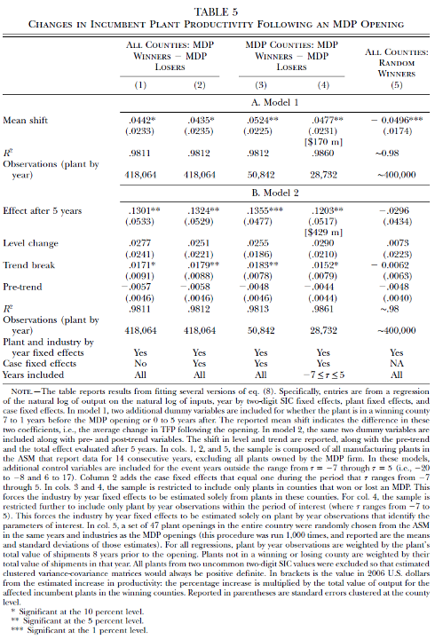

layout: true
<div style="position: absolute;left:20px;bottom:5px;color:black;font-size: 12px;">`r rmarkdown::metadata$author` (Tulane) | `r rmarkdown::metadata$subtitle` | `r format(Sys.time(), '%d %B %Y')`</div>

<!--- `r rmarkdown::metadata$subtitle` | `r format(Sys.time(), '%d %B %Y')`-->

```{r, load_refs, echo=FALSE, cache=FALSE, message=FALSE}
library(RefManageR)
BibOptions(check.entries = FALSE, 
           bib.style = "authoryear", 
           cite.style = 'authoryear', 
           style = "markdown",
           hyperlink = FALSE, 
           dashed = FALSE)
myBib <- ReadBib("assets/example.bib", check = FALSE)
top_icon = function(x) {
  icons::icon_style(
    icons::fontawesome(x),
    position = "fixed", top = 10, right = 10
  )
}
```

```{r setup, include=FALSE}
options(htmltools.dir.version = FALSE)
library(knitr)
opts_chunk$set(
  fig.align="center",  
  fig.height=4, fig.width=6,
  out.width="748px", out.length="520.75px",
  dpi=300, #fig.path='Figs/',
  cache=F#, echo=F, warning=F, message=F
  )
```


```{r, cache=FALSE, message=FALSE, warning=FALSE, include=TRUE, eval=TRUE, results=FALSE, echo=FALSE, tidy.opts = list(width.cutoff = 50), tidy = TRUE}
## Load and install the packages that we'll be using today
if (!require("pacman")) install.packages("pacman")
pacman::p_load(tidyverse, hrbrthemes, dtplyr, ggpubr, viridis, wesanderson, sysfonts, showtextdb, showtext, thematic, googleVis, png, grid)
# devtools::install_github("thomasp85/patchwork")
remotes::install_github("mitchelloharawild/icons")
remotes::install_github("ROpenSci/bibtex")

# devtools::install_github("ajdamico/lodown")
## My preferred ggplot2 plotting theme (optional)
## https://github.com/hrbrmstr/hrbrthemes
# scale_fill_ipsum()
# scale_color_ipsum()
font_add_google("Fira Sans", "firasans")
font_add_google("Fira Code", "firasans")

showtext_auto()

theme_customs <- theme(
  text = element_text(family = 'firasans', size = 16),
  plot.title.position = 'plot',
  plot.title = element_text(
    face = 'bold', 
    colour = thematic::okabe_ito(8)[6],
    margin = margin(t = 2, r = 0, b = 7, l = 0, unit = "mm")
  ),
)

colors <-  thematic::okabe_ito(5)

# theme_set(theme_minimal() + theme_customs)
theme_set(hrbrthemes::theme_ipsum() + theme_customs)
## Set master directory where all sub-directories are located
mdir <- "/Users/hhadah/Documents/GiT/urban-econ/slides/01-week1/tue"

## Set working directory

# COLOR PALLETES
library(paletteer) 
# paletteer_d("awtools::a_palette")
# paletteer_d("suffrager::CarolMan")

### COLOR BLIND PALLETES
#paletteer_d("colorblindr::OkabeIto")
#paletteer_d("colorblindr::OkabeIto_black")
# paletteer_d("colorBlindness::paletteMartin")
# paletteer_d("colorBlindness::Blue2DarkRed18Steps")
# paletteer_d("colorBlindness::SteppedSequential5Steps")
# paletteer_d("colorBlindness::PairedColor12Steps")
# paletteer_d("colorBlindness::ModifiedSpectralScheme11Steps")
colorBlindness <- paletteer_d("colorBlindness::Blue2Orange12Steps")
cbbPalette <- c("#000000", "#E69F00", "#56B4E9", "#009E73", "#F0E442", "#0072B2", "#D55E00", "#CC79A7")

# scale_colour_paletteer_d("colorBlindness::ModifiedSpectralScheme11Steps", dynamic = FALSE)
# To use for fills, add
  scale_fill_manual(values="colorBlindness::Blue2Orange12Steps")

# To use for line and point colors, add
  scale_colour_manual(values="colorBlindness::Blue2Orange12Steps")
  #<a><button>[Click me](#sources)</button></a>
remotes::install_github("gadenbuie/xaringanExtra")
xaringanExtra::use_scribble() ## Draw on slides. Requires dev version of xaringanExtra.
xaringanExtra::use_xaringan_extra(c("tile_view", "animate_css", "tachyons"))
#install.packages("countdown")
```

```{css, echo=F}
    /* Table width = 100% max-width */

    .remark-slide table{
        width: auto !important; /* Adjusts table width */
    }

    /* Change the background color to white for shaded rows (even rows) */

    .remark-slide thead, .remark-slide tr:nth-child(2n) {
        background-color: white;
    }
    .remark-slide thead, .remark-slide tr:nth-child(n) {
        background-color: white;
    }
```

---
class: title-slide
background-image: url("assets/TulaneLogo-white.svg"), url("assets/title-image1.jpg")
background-position: 10% 90%, 100% 50%
background-size: 160px, 50% 100%
background-color: #0148A4

# .text-shadow[.white[Outline for Today]]

<ol>
    <li><h4 class="white">General layout of statistical results tables</h4></li>
    <li><h5 class="white">Coefficients and standard errors – what they mean</h5></li>
    <li><h5 class="white">Constructing confidence intervals: 90%, 95%, and 99%</h5></li>
    <li><h5 class="white">Hypothesis testing: 10%, 5%, and 1% levels</h5></li>
    <li><h5 class="white">What do the &ast;s beside the estimates mean?</h5></li>
</ol>

---
## This Week

- Don't forget about the Difference-in-differences quiz

---
## General layout of statistical results tables

.pull-left[
  - Top numbers are the estimates.
    - Usually these are coefficient estimates from a regression, but sometimes they are just means or differences in means.
    - These tell you the estimated effect, difference, etc.
    - These tell you the magnitude of the effect or difference – was it small or large? Negative or positive?
]

.pull-right[
  ```{r table1, echo=FALSE, warning=FALSE, out.width="200%", fig.show='hold', fig.align='center'}
# Read the image file
img1 <- readPNG("assets/table-1.png")

# Plot the image
grid.raster(img1)
  ```

]

---
## General layout of statistical results tables

.pull-left[
  - Under each estimate, in (), is the standard error (SE) of the estimate.
    - The SE tells us how precise the estimate is. How sure are we of this estimate?
    - Larger SE = less precise estimate, the estimate has a larger margin of error.
    - A confidence interval for this estimate would be wider (as we shall see).
]

.pull-right[
  ```{r table1-1, echo=FALSE, warning=FALSE, out.width="200%", fig.show='hold', fig.align='center'}
# Read the image file
img1 <- readPNG("assets/table-1.png")

# Plot the image
grid.raster(img1)
  ```

]

---
## More tables

.pull-left[
  - I will explain more about all these tables later, but for not just notice the typical format: estimate with standard errors underneath it. Also notice the use of &ast;s, which I will explain shortly. These indicate how statistically significant an estimate is.

    ```{r table3, echo=FALSE, warning=FALSE, out.width="100%", fig.show='hold', fig.align='center'}
    # Read the image file
    img2 <- readPNG("assets/table-3.png")

    # Plot the image
    grid.raster(img2)
    ```

]

.pull-right[
  ```{r table2, echo=FALSE, warning=FALSE, out.width="100%", fig.show='hold', fig.align='center'}
  # Read the image file
  img3 <- readPNG("assets/table-2.png")

  # Plot the image
  grid.raster(img3)
  ```
]

---
## Coefficients and standard errors – what they mean

- Estimate (top number) tell us the effect that was estimated and what the magnitude of the effect was.
- The standard error tells us how precise that estimate is (how much margin of error does it have?)
- Here are some examples of coefficients that may make this easier to understand for those of you who haven’t taken econometrics or any statistics courses that use regression.

---
## Coefficients and standard errors – what they mean

- Suppose I estimated the mean (average) productivity of firms in county A and in county B. These are hypothetical numbers.
  - County A = 100, with a standard error of 10. 
  - County B = 90, with a standard error of 12.
  - The difference (A – B) is 10, and suppose it has a standard error of 15.
  - Let’s focus on this estimate of 10, with a standard error of 15.
- The estimate of 10 tells us that county A’s productivity is estimated to be 10 higher than county B’s productivity, on average.
- The standard error is 15, which is fairly high.
- How do we use this standard error to tell us how precise our estimate is?
- The best way to do it is by using it to construct a confidence interval.

---
## Constructing confidence intervals

- There are usually three confidence intervals that (social) scientists create: 90%, 95%, and 99% confidence intervals.
- The intuitive<sup>&ast;</sup> way to understand these is:
  - The 90% (95%, 99%) confidence interval tells us that, under the assumption that our statistical model is correct, the true effect we are measuring lies within our confidence interval 90% (95%, 99%) of the time.
  - For example, suppose the 95% confidence interval of an estimate was (-0.3 to 0.1). Then we are 95% confident that the true effect, the thing we are estimating, lies between -0.3 and 0.1.
- Thus, this confidence intervals tell us how sure we are of our estimates, since it’s impossible to be sure what they are exactly, given randomness and noise in the data.<sup>1</sup>

.pull-right[.footnote[<sup>&ast;</sup> For those with more theoretical stats training, you’ll know that this intuitive explanation isn’t technically correct, but I am not looking to explain to beginners the difference between frequentist and Bayesian statistics or the repeated sampling nature of classical statistics.]
]

---
## Constructing confidence intervals

- How do we make 90%, 95%, and 99% confidence intervals?
- The general formula is:
- Lower bound: Estimate – critical value &ast; standard error
- Upper bound: Estimate + critical value &ast; standard error
- Where the critical value is 1.645 for a 90% interval, 1.96 for 95%, and 2.576 for 99%.
- Going back to our original example, we had an estimate of 10 and a standard error of 15
- Lower bound: 10 – critical value &ast; 15
- Upper bound: 10 + critical value &ast; 15
- Where the critical value is 1.645 for a 90% interval, 1.96 for 95%, and 2.576 for 99%.
- Lower bound: 10 – critical value &ast; 15 = 10 – 1.645&ast;15 = 10 – 24.675 = -14.675 
- Upper bound: 10 + critical value &ast; 15 = 10 + 1.645&ast;15 = 10 + 24.675 = 34.675
- Therefore, the 90% confidence interval is (-14.675, 34.675).

---
## Constructing confidence intervals – 90%

- Lower bound: 10 – critical value &ast; 15 = 10 – 1.645&ast;15 = 10 – 24.675 = -14.675 
- Upper bound: 10 + critical value &ast; 15 = 10 + 1.645&ast;15 = 10 + 24.675 = 34.675
- Therefore, the 90% confidence interval is (-14.675, 34.675).

---
## Constructing confidence intervals – 95%

- Lower bound: 10 – critical value &ast; 15 = 10 – 1.96&ast;15 = 10 – 29.4 = -19.4 
- Upper bound: 10 + critical value &ast; 15 = 10 + 1.96&ast;15 = 10 + 29.4 = 39.4
- Therefore, the 95% confidence interval is (-19.4, 39.4).

---
## Constructing confidence intervals – 95%

.pull-left[
  ```{r hot-tip, echo=FALSE, warning=FALSE, out.width="100%", fig.show='hold', fig.align='center'}
  # Read the image file
  img4 <- readPNG("assets/hot-tip.png")

  # Plot the image
  grid.raster(img4)
  ```
]
.pull-right[
  - Lower bound: 10 – critical value &ast; 15 = 10 – 1.96&ast;15 = 10 – 29.4 = -19.4 
  - Upper bound: 10 + critical value &ast; 15 = 10 + 1.96&ast;15 = 10 + 29.4 = 39.4
  - Therefore, the 95% confidence interval is (-19.4, 39.4).
  - **1.96 is very close to 2**, so you can calculate an “eye-ball” confidence interval (not a technical term) by using 2:
  - Lower = 10 – 2&ast;15 = 10 – 30 = -20
  - Upper = 10 + 2&ast;15 = 10 + 30 = 40
]

---
## Constructing confidence intervals – 99%

- Lower bound: 10 – critical value &ast; 15 = 10 – 2.576&ast;15 = 10 – 38.64 = -28.64
- Upper bound: 10 + critical value &ast; 15 = 10 + 2.576&ast;15 = 10 + 38.64 = 48.64
- Therefore, the 99% confidence interval is (-28.64, 48.64).

---
## Comparing confidence intervals

- For our example of an estimate of 10, with a standard error of 15, our confidence intervals are:
- The 90% confidence interval is (-14.675, 34.675).
- The 95% confidence interval is (-19.4, 39.4).
- The 99% confidence interval is (-28.64, 48.64).
- Notice how as we move higher in confidence, the confidence interval grows.
- To be more sure that our interval contains the true value (higher % confidence), we have to increase the interval.

---
class: segue-yellow
background-image: url("assets/TulaneLogo.svg")
background-size: 20%
background-position: 95% 95%

# Confidence Intervals Examples

---
## Example of confidence intervals

```{python, echo=FALSE, warning=FALSE, results='hide', out.width="80%", fig.show='hold', fig.align='center'}
import numpy as np
import matplotlib.pyplot as plt
from scipy import stats

# Set the seed at the beginning to ensure reproducibility for the entire process
np.random.seed(0)

# Creating a large sample to represent the population
population_size = 10000
population = np.random.normal(loc=10, scale=1, size=population_size)
population_mean = np.mean(population)  # Calculating the actual mean of the population

# Function to simulate confidence intervals
def simulate_confidence_intervals(simulations, sample_size, confidence_level):
    sample_means = []
    confidence_intervals = []

    for _ in range(simulations):
        # Generating a random sample from the population
        sample = np.random.choice(population, size=sample_size, replace=False)
        sample_mean = np.mean(sample)
        standard_error = stats.sem(sample)

        # Calculating the confidence interval
        confidence_interval = stats.t.interval(confidence_level, sample_size-1, loc=sample_mean, scale=standard_error)

        sample_means.append(sample_mean)
        confidence_intervals.append(confidence_interval)

    return sample_means, confidence_intervals

# Generating a random sample of size 30 from the population
sample_size = 30
sample = np.random.choice(population, size=sample_size, replace=False)
sample_mean = np.mean(sample)  # Calculating the actual mean of the sample
standard_error = stats.sem(sample)
sample_confidence_interval = stats.t.interval(0.95, sample_size-1, loc=sample_mean, scale=standard_error)

# Simulate 100 confidence intervals with a sample size of 30 and a 95% confidence level
simulations = 100
confidence_level = 0.95
sample_means, confidence_intervals = simulate_confidence_intervals(simulations, sample_size, confidence_level)

# Setting up the figure and axes for all plots
fig, axs = plt.subplots(1, 3, figsize=(18, 6))  # 1 row, 3 columns

# Plotting the population distribution in the first subplot
axs[0].hist(population, bins=30, color='skyblue', edgecolor='black', alpha=0.7)
axs[0].axvline(10, color='red', linestyle='dashed', linewidth=2, label=f'Mean: 10')
axs[0].set_title('Population Distribution')
axs[0].set_xlabel('Value')
axs[0].set_ylabel('Frequency')
axs[0].legend()

# Plotting the sample distribution and its 95% CI in the second subplot
axs[1].hist(sample, bins=15, color='green', edgecolor='black', alpha=0.7)
axs[1].axvline(sample_mean, color='red', linestyle='dashed', linewidth=2, label=f'Mean: {sample_mean:.2f}')
axs[1].axvline(10, color='blue', linestyle='dashed', linewidth=2, label=f'Actual Mean: 10')
axs[1].axvspan(sample_confidence_interval[0], sample_confidence_interval[1], alpha=0.3, color='yellow', label='95% CI')
axs[1].set_title('Sample Distribution')
axs[1].set_xlabel('Value')
axs[1].set_ylabel('Frequency')
axs[1].legend()

# Plotting the simulated confidence intervals in the third subplot
for mean, interval in zip(sample_means, confidence_intervals):
    axs[2].plot([mean, mean], [interval[0], interval[1]], color='grey', marker='o')
for mean, interval in zip(sample_means, confidence_intervals):
    if interval[0] > 10 or interval[1] < 10:
        axs[2].plot([mean, mean], [interval[0], interval[1]], color='red', marker='o')
axs[2].axhline(10, color='blue', linestyle='--', label='True Population Mean')
axs[2].set_title("Simulated Confidence Intervals (95%)")
axs[2].set_xlabel("Sample Mean")
axs[2].set_ylabel("Confidence Interval Range")
axs[2].legend()

# Adjust layout to prevent overlap
plt.tight_layout()

# Display the plots
plt.show()
```

---
class: segue-yellow
background-image: url("assets/TulaneLogo.svg")
background-size: 20%
background-position: 95% 95%

# Confidence Intervals Activity

---
## Activity break – Calculating confidence intervals  `r top_icon("pause")`

- Let’s take a break from lecture to calculate some intervals.
- For this, I’m going to have you calculate “eye-ball” 95% confidence intervals, i.e. using 2 instead of 1.96 for the critical value.
- Therefore, the formula is:
  - Lower bound = estimate – 2&ast;SE, Upper bound = estimate + 2&ast;SE
- Remember order of operations -> multiply SE by 2 first!
- I’ll give you five minutes to do the short quiz “Confidence Interval Calculation” on Canvas. I’ll put you into breakout rooms so you can more easily ask each other or me (by summoning me) questions.

```{r first-timer, echo=FALSE, message=FALSE}
library(countdown)
countdown(
  minutes = 5, seconds = 0,
  play_sound = FALSE
)
```

---
class: segue-yellow
background-image: url("assets/TulaneLogo.svg")
background-size: 20%
background-position: 95% 95%

# Hypothesis Testing 

---
## Hypothesis testing

- In addition to calculating confidence intervals, we often do hypothesis testing.
- Mostly, we test to see if our estimates are statistically significantly different from zero.
  - This is, are we reasonably sure that the true value, which we estimated, is different from zero?
- Different from zero is useful to test because if it is different from zero, then it implies that there is likely an effect or a difference.
- If an estimate is not statistically significantly different from zero, we don’t have enough statistical evidence to claim that there is an effect.

---
## Hypothesis testing: 10%, 5%, and 1% levels

- We typically test for statistical significance at the following levels:
  - 10%, which corresponds to a 90% confidence interval,
  - 5%, which corresponds to a 95% confidence interval,
  - 1%, which corresponds to a 99% confidence interval.
- The 10%, 5%, and 1% here refer to the amount of what is called “Type 1 error”, which can be interpreted as a false positive rate (finding an effect that does not exist).
  - Under 10% (5%, 1%), you will find an effect (difference from zero) that does not actually exist 10% (5%, 1%) of the time.

---
## Balancing Type 1 and Type 2 Error

- Statistics tries to balance to types of error:
- Type 1 error -> “false positive”
  - E.g., finding an effect where there is actually no effect.
  - A positive test result when really the person is negative.
- Type 2 error -> “false negative”
  - E.g., finding no effect (not statistically different from zero) when really there is an effect.
  - A negative test result when really the person is positive. 

---
## Balancing Type 1 and Type 2 Error

```{r errors-and-balance, echo=FALSE, warning=FALSE, out.width="50%", fig.show='hold', fig.align='center'}
# Read the image file
img5 <- readPNG("assets/table-4.png")
# Plot the image
grid.raster(img5)
```

If we decrease the level that we test at (e.g., from 5% to 1%, which would be the same as moving from a 95%
confidence interval to a 99% confidence interval) then we decrease the probability of making Type 1 Errors
(fewer false positives) but we increase the probability of making Type 2 Errors (more false negatives).

---

.center[]

---
## Which Type of error is this concept minimizing?

> It is better that ten guilty persons escape than that one innocent suffer. - William Blackstone


--

- In the context of the criminal justice system
  - Type I error occurs when an innocent person is wrongfully convicted
  - Type II error, or "false negative," occurs when a guilty person is wrongfully acquitted

---
## Hypothesis testing formula

- To do a hypothesis test, at any level (10%, 5%, 1%), to see if our estimate is statistically different from zero, we first calculate a t-statistic as follows:

$$
t = \frac{\text{estimate} - 0}{\text{SE}}
$$

- The formula for hypothesis testing is:
  - Test statistic = (estimate – null hypothesis value) / standard error
  - The null hypothesis value is usually zero, but it can be any value.
  - The standard error is the standard error of the estimate.

--
- E.g., if the coefficient is 0.2 and the standard error is 0.1, the t-statistic is 2.
- E.g., if the coefficient is -2 and the standard error is 2, the t-statistic is -1.

---
## Hypothesis testing formula

- Once we have our t-statistic, we compare it to a critical value.
- These are the same critical values used to create confidence intervals.
- The critical values are…
  - 1.645 for a test at the 10% level of significance (90% confidence interval)
  - 1.96 for a test at the 5% level of significance (95% confidence interval)
  - 2.576 for a test at the 1% level of significance (99% confidence interval)
- If our critical value is, in **absolute value**, greater than that critical value, then it is at least significant at that level.
- $|t-statistic| \ge \text{critical value}$
  - The | | means “take the absolute value of”
  - So, if your t-statistic is negative (i.e. your estimate is negative), then just multiply it by -1 to make it positive.

---
## Hypothesis testing Example

  - 1.645 for a test at the 10% level of significance
  - 1.96 for a test at the 5% level of significance 
  - 2.576 for a test at the 1% level of significance 
- $|t-statistic| \ge \text{critical value}$
- Suppose our t-statistic is 2.2.
  - It’s greater in absolute value than 1.645 and 1.96, but not 2.576.
  - Therefore it is significant at the 5% level, but not the 1% level.
- Suppose our t-statistic is -1.7.
  - It’s greater in absolute value than 1.645, but not 1.96 or 2.576.
  - Therefore it is significant at the 10% level, but not the 5% or 1% levels.

---
## Hypothesis testing Example

.pull-left[
- Instead of using 1.96 as the critical value to test at the 5% level, use 2.
- The “eye-ball” t-test at the 5% level is just dividing the coefficient by the standard error and seeing if that t-statistic is greater than 2 in absolute value.
- You can often do this just by looking at coefficient estimates with their standard errors in tables.
- E.g.,   0.038  (0.017)
- I can see that that’s bigger than 2.
]
.pull-right[
  ```{r hot-tip2, echo=FALSE, warning=FALSE, out.width="100%", fig.show='hold', fig.align='center'}
  # Read the image file
  img4 <- readPNG("assets/hot-tip.png")

  # Plot the image
  grid.raster(img4)
  ```
]

---
## Activity break – t-statistics and hypothesis testing  `r top_icon("pause")`

- Let’s take a break from lecture to calculate some intervals.
- For this, I’m going to have you do hypothesis tests (“t-tests”) using the “eye-ball” method, i.e. using 2 instead of 1.96 for the critical value.
- Therefore, the formula is:
  - $|t-statistic| \ge 2$
- I’ll give you five minutes to do the short quiz “t-statistics and hypothesis testing” on Canvas. Ask each other or me questions.

```{r second-timer, echo=FALSE, message=FALSE}
library(countdown)
countdown(
  minutes = 5, seconds = 0,
  play_sound = FALSE
)
```

---
## What do the &ast;s beside the estimates in tables mean?

.pull-left[
  - Usually statistical tables have notes under them that detail what &ast;, &ast;&ast;, &ast;&ast;&ast;
  - More &ast;s means more statistically significant -> we are even more sure that there is an effect (i.e. that the estimate is different). The risk of Type 1 error (false positive) is lower as significance increases.

    ```{r table3-2, echo=FALSE, warning=FALSE, out.width="90%", fig.show='hold', fig.align='center'}
    # Read the image file
    img2 <- readPNG("assets/table-3.png")

    # Plot the image
    grid.raster(img2)
    ```

]

.pull-right[
  
]

---
## What do the &ast;s beside the estimates in tables mean?

- Most tables use the following convention, but check the table notes to be sure.
- No &ast;s means not statistically significant at the 10% level (or any more stringent levels: 5%, 1%, etc.).
- &ast; means statistically significantly different from zero at the 10% level.
  - Or, zero does not fall into the 90% confidence interval
- &ast;&ast; means statistically significantly different from zero at the 5% level.
  - Or, zero does not fall into the 95% confidence interval
- &ast;&ast;&ast; means statistically significantly different from zero at the 1% level.
  - Or, zero does not fall into the 99% confidence interval

---
## What do the &ast;s beside the estimates in tables mean?

- Note: anything significant at the 1% level (&ast;&ast;&ast;) is also significant at the 5% level (&ast;&ast;) and the 10% level (&ast;).
- Similarly, anything significant at the 5% level (&ast;&ast;) is also significant at the 10% level (&ast;).
- Testing at the 5% level is the most common benchmark of statistical significance used.
- So, when researchers say something is statistically significant, they usually mean that it’s statistically significant at at least the 5% level.
- The 1% level is the strongest conventional level, although you can test at any level (e.g., some researchers test at the 0.1% level).

---
## What do the &ast;s beside the estimates in tables mean?

- You can use the &ast; system to quickly see how significant estimates are.
- This avoids you having to do more time-intensive ways at gauging the statistical significant of the estimates, such as:
  - Calculating a t-statistic (coefficient divided by standard error) and seeing if it’s greater than two (which would mean its significant at the 5% level).
  - Calculating a confidence interval.
- Again, just be sure to check the table notes to be sure you are interpreting the &ast; system correctly.  

---
## Other table conventions – t-stats in ()

- The majority of social sciences, outside of usually psychology, tend to present statistical results the way I detailed here:
  - Estimate, with standard errors in () underneath
- However, some fields or older papers put **t-statistics** underneath the estimates.
.pull-left[
- So instead of 2.0 (1.0)
]
.pull-right[
- They would have: 2.0 (2.0)
]

- Check the table notes so you know what is in the ()!

---
## Other table conventions – p-value in ()

- The majority of social sciences, outside of usually psychology, tend to present statistical results the way I detailed here:
- Estimate, with standard errors in () underneath
- However, some fields or older papers put p-values underneath the estimates.

.pull-left[
- So instead of 1.96 (1.0)
]

.pull-right[
- They would have: 1.96 (0.05) or 1.96 $[0.05]$
]

- The p-value is significance level, so 0.05 means significant at the 5% level.
- A p-value of 0.01 means significant at the 1% level, etc.

---
class: segue-yellow
background-image: url("assets/TulaneLogo.svg")
background-size: 20%
background-position: 95% 95%

# Difference-in-differences R Code: Optional `r top_icon("code")` 

---
## Difference-in-differences R Code

- This tutorial is base on David Card and Alan B. Krueger (1994) "Minimum Wages and Employment: A Case Study of the Fast-Food Industry in New Jersey and Pennsylvania" *American Economic Review* 84(4): 772-793.

---
## Difference-in-differences R Code

- First, we need to load the data and install the packages we will use.

- The dataset could be downloaded from [here](https://raw.githubusercontent.com/hhadah/urban-econ/main/slides/03-week3/02-thur/assets/minwage_short.csv)

```{r, echo=TRUE, warning=FALSE, message=FALSE, out.width="100%", fig.show='hold', fig.align='center'}
# Load the data
library(haven)
library(tidyverse)
library(dplyr)
library(readr)
library(broom)

urlfile = "https://raw.githubusercontent.com/hhadah/urban-econ/main/slides/03-week3/02-thur/assets/minwage_short.csv"

# Load the data
data <- read_csv(url(urlfile))
names(data)
```


---
## Difference-in-differences R Code

- Filter missing data

```{r, echo=TRUE, warning=FALSE, message=FALSE, out.width="100%", fig.show='hold', fig.align='center'}
min_wage_data <- data %>%
  filter(!(is.na(emptot1)), !(is.na(emptot2)))
names(min_wage_data)
```

- Create a new variable `treat` to indicate the treatment group

```{r, echo=TRUE, warning=FALSE, message=FALSE, out.width="100%", fig.show='hold', fig.align='center'}
min_wage_data <- min_wage_data %>%
  mutate(nj = state == 1)
```

---
## Do Difference-in-differences by hand

```{r, echo=TRUE, warning=FALSE, message=FALSE, out.width="100%", fig.show='hold', fig.align='center'}
nj_before <- min_wage_data %>%
  filter(nj == 1) %>%
  summarise(mean_empt1 = mean(emptot1), sd_empt1 = sd(emptot1))
nj_after <- min_wage_data %>%
  filter(nj == 0) %>%
  summarise(mean_empt1 = mean(emptot1), sd_empt1 = sd(emptot1))
pa_before <- min_wage_data %>%
  filter(nj == 1) %>%
  summarise(mean_empt2 = mean(emptot2), sd_empt2 = sd(emptot2))
pa_after <- min_wage_data %>%
  filter(nj == 0) %>%
  summarise(mean_empt2 = mean(emptot2), sd_empt2 = sd(emptot2))
```

---
## Do Difference-in-differences by hand

.pull-left[
```{r, echo=TRUE, warning=FALSE, message=FALSE, out.width="100%", fig.show='hold', fig.align='center'}
nj_after
nj_before
```
]

.pull-right[
```{r, echo=TRUE, warning=FALSE, message=FALSE, out.width="100%", fig.show='hold', fig.align='center'}
pa_after
pa_before
```
]

```{r, echo=TRUE, warning=FALSE, message=FALSE, out.width="100%", fig.show='hold', fig.align='center'}
nj_after - nj_before - (pa_after - pa_before)
```

---
## Do Difference-in-differences by hand

### Now, change over time (after - before)

```{r, echo=TRUE, warning=FALSE, message=FALSE, out.width="100%", fig.show='hold', fig.align='center'}
min_wage_data <- min_wage_data %>%
  mutate(demp = (emptot2 - emptot1))
summary_demp <- min_wage_data %>%
  group_by(state) %>%
  summarise(mean = mean(demp), sd = sd(demp))
summary_demp
```

---
## Difference-in-differences in regression form

```{r, echo=TRUE, warning=FALSE, message=FALSE, out.width="100%", fig.show='hold', fig.align='center'}
DD_Regression <- lm(demp ~ nj, data = min_wage_data)
tidy(DD_Regression)
```


```{r gen_pdf, include = FALSE, cache = FALSE, eval = FALSE}
library(renderthis)
# https://hhadah.github.io/urban-econ/slides/03-week3/02-thur/02-class2.html

to_pdf(from = "~/Documents/GiT/urban-econ/slides/03-week3/02-thur/02-class2.html", 
       to = "~/Documents/GiT/urban-econ/slides/03-week3/02-thur/02-class2.pdf")
to_pdf(from = "~/Documents/GiT/urban-econ/slides/03-week3/02-thur/02-class2.html")
```
