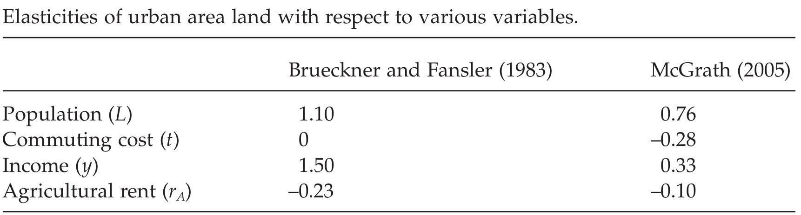
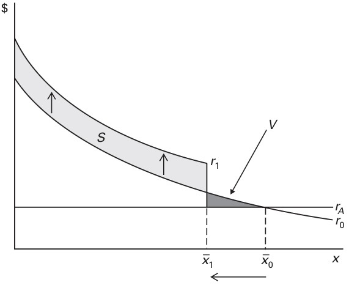
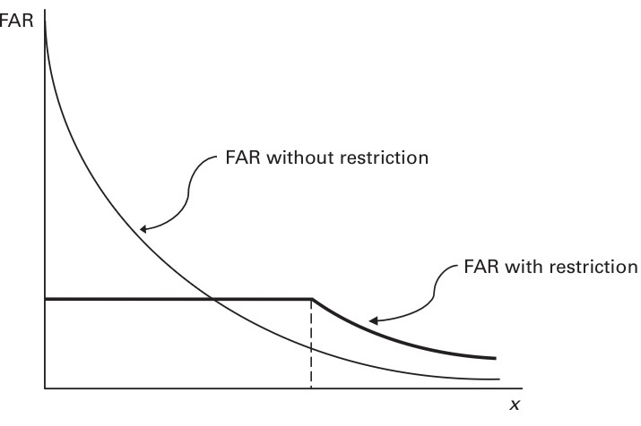
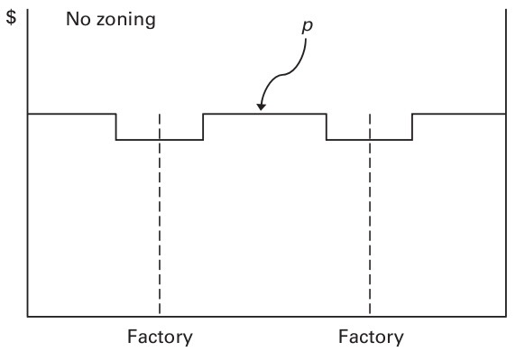
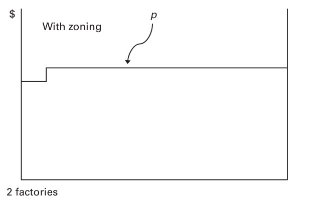

layout: true
<div style="position: absolute;left:20px;bottom:5px;color:black;font-size: 12px;">`r rmarkdown::metadata$author` (Tulane) | `r rmarkdown::metadata$subtitle` | `r format(Sys.time(), '%d %B %Y')`</div>

<!--- `r rmarkdown::metadata$subtitle` | `r format(Sys.time(), '%d %B %Y')`-->

```{r, load_refs, echo=FALSE, cache=FALSE, message=FALSE}
library(RefManageR)
BibOptions(check.entries = FALSE, 
           bib.style = "authoryear", 
           cite.style = 'authoryear', 
           style = "markdown",
           hyperlink = FALSE, 
           dashed = FALSE)
myBib <- ReadBib("assets/example.bib", check = FALSE)
top_icon = function(x) {
  icons::icon_style(
    icons::fontawesome(x),
    position = "fixed", top = 10, right = 10
  )
}
```

```{r setup, include=FALSE}
# xaringanExtra::use_scribble() ## Draw on slides. Requires dev version of xaringanExtra.

options(htmltools.dir.version = FALSE)
library(knitr)
opts_chunk$set(
  fig.align="center",  
  fig.height=4, fig.width=6,
  out.width="748px", out.length="520.75px",
  dpi=300, #fig.path='Figs/',
  cache=F#, echo=F, warning=F, message=F
  )
```


```{r, cache=FALSE, message=FALSE, warning=FALSE, include=TRUE, eval=TRUE, results=FALSE, echo=FALSE, tidy.opts = list(width.cutoff = 50), tidy = TRUE}
## Load and install the packages that we'll be using today
if (!require("pacman")) install.packages("pacman")
pacman::p_load(tictoc, parallel, pbapply, future, future.apply, furrr, RhpcBLASctl, memoise, here, foreign, mfx, tidyverse, hrbrthemes, estimatr, ivreg, fixest, sandwich, lmtest, margins, vtable, broom, modelsummary, stargazer, fastDummies, recipes, dummy, gplots, haven, huxtable, kableExtra, gmodels, survey, gtsummary, data.table, tidyfast, dtplyr, microbenchmark, ggpubr, tibble, viridis, wesanderson, censReg, rstatix, srvyr, formatR, sysfonts, showtextdb, showtext, thematic, sampleSelection, RefManageR, DT, googleVis, png, grid)
# devtools::install_github("thomasp85/patchwork")
remotes::install_github("mitchelloharawild/icons")
remotes::install_github("ROpenSci/bibtex")

# devtools::install_github("ajdamico/lodown")
## My preferred ggplot2 plotting theme (optional)
## https://github.com/hrbrmstr/hrbrthemes
# scale_fill_ipsum()
# scale_color_ipsum()
font_add_google("Fira Sans", "firasans")
font_add_google("Fira Code", "firasans")

showtext_auto()

theme_customs <- theme(
  text = element_text(family = 'firasans', size = 16),
  plot.title.position = 'plot',
  plot.title = element_text(
    face = 'bold', 
    colour = thematic::okabe_ito(8)[6],
    margin = margin(t = 2, r = 0, b = 7, l = 0, unit = "mm")
  ),
)

colors <-  thematic::okabe_ito(5)

# theme_set(theme_minimal() + theme_customs)
theme_set(hrbrthemes::theme_ipsum() + theme_customs)
## Set master directory where all sub-directories are located
mdir <- "/Users/hhadah/Documents/GiT/urban-econ/slides/01-week1/tue"

## Set working directory

# COLOR PALLETES
library(paletteer) 
# paletteer_d("awtools::a_palette")
# paletteer_d("suffrager::CarolMan")

### COLOR BLIND PALLETES
#paletteer_d("colorblindr::OkabeIto")
#paletteer_d("colorblindr::OkabeIto_black")
# paletteer_d("colorBlindness::paletteMartin")
# paletteer_d("colorBlindness::Blue2DarkRed18Steps")
# paletteer_d("colorBlindness::SteppedSequential5Steps")
# paletteer_d("colorBlindness::PairedColor12Steps")
# paletteer_d("colorBlindness::ModifiedSpectralScheme11Steps")
colorBlindness <- paletteer_d("colorBlindness::Blue2Orange12Steps")
cbbPalette <- c("#000000", "#E69F00", "#56B4E9", "#009E73", "#F0E442", "#0072B2", "#D55E00", "#CC79A7")

# scale_colour_paletteer_d("colorBlindness::ModifiedSpectralScheme11Steps", dynamic = FALSE)
# To use for fills, add
  scale_fill_manual(values="colorBlindness::Blue2Orange12Steps")

# To use for line and point colors, add
  scale_colour_manual(values="colorBlindness::Blue2Orange12Steps")
  #<a><button>[Click me](#sources)</button></a>
```

```{css, echo=F}
    /* Table width = 100% max-width */

    .remark-slide table{
        width: auto !important; /* Adjusts table width */
    }

    /* Change the background color to white for shaded rows (even rows) */

    .remark-slide thead, .remark-slide tr:nth-child(2n) {
        background-color: white;
    }
    .remark-slide thead, .remark-slide tr:nth-child(n) {
        background-color: white;
    }
```

---
class: title-slide
background-image: url("assets/TulaneLogo-white.svg"), url("assets/title-image1.jpg")
background-position: 10% 90%, 100% 50%
background-size: 160px, 50% 100%
background-color: #0148A4
# .text-shadow[.white[Outline for Today]]

<ol>
    <li><h4 class="white"> Evidence on City Sprawl</h4></li>
    <li><h4 class="white"> Market Failures Leading to Sprawl</h4></li>
    <li><h4 class="white"> Land-Use Controls to Limit Sprawl</h4></li>
</ol>

---
## Next week `r top_icon("calendar-week")`


### Readings


---
class: segue-yellow
background-image: url("assets/TulaneLogo.svg")
background-size: 20%
background-position: 95% 95%

# Introduction

---
## Urban sprawl has been drawing strong feelings `r top_icon("angry")` 

.pull-left[
### Critics say:

- Increases traffic congestion and pollution `r icons::fontawesome("car-crash")`
- Consumes too much land `r icons::fontawesome("tree")`
- Less incentives to develop downtown areas `r icons::fontawesome("city")`
- Low density sprawl reduces social interaction `r icons::fontawesome("people-arrows")`
- Dependence on automobiles increases obesity rates
]

.pull-right[
### The data shows:
- Spatial growth was really high---from 1.3% to 1.9% of land area got developed from 1976 to 1992 (Burchfield et al., 2006) `r icons::fontawesome("chart-line")`
- Other sources show that the rate is even higher
]

As a result, many cities have implemented land-use controls to limit sprawl 

---
## Growth management policies to control urban sprawl `r top_icon("city")`

### At least 12 states have growth management policies

### New Jersey committed in 1998 to spend $1 billion to purchase vacant land to limit 

---
## Do the critics have a point? `r top_icon("question")`

<br>

### Do cities take up too much space?

<br>

### Should they implement land-use controls to limit sprawl?

---
class: segue-yellow
background-image: url("assets/TulaneLogo.svg")
background-size: 20%
background-position: 95% 95%

# The Empirical Evidence

---
## This table shows the results from two papers


```{r table01, echo=FALSE, message=FALSE, warning=FALSE, results='asis', width='120%'}
# insert image

```

#### The results tells us if X increases by 1 percent, Y increases by how much percent?

#### Both studies show that higher population leads to more land use

  - 1 percent increase in population leads to 1.1 and 0.76 percent increase in land use

#### Income effects are large: 1 percent increase in income leads to 1.5 and 0.3 percent increase in land use

#### Higher agricultural rent leads to less land use, mixed evidence on the effect of commuting costs 

---
## It is easy to see why urban sprawl happens in the US 

<br>

### So, if we are growing in population and getting richer, is it bad that we are sprawling out?

<br>

--

### Well, it depends

### If this sprawl is being driven by consumer preferences, then it is .brand-mardigras[not a problem]

### However, if sprawl is being driven by market failures, then it is a .brand-crawfest[problem]

---
## Market failures related present in economic process that determines size of cities

<br>

### 1. The amenity value of open space

<br>

- Assume each acre of open space provides $\mathbf{b}$ dollars above and beyond its agricultural value
- This benefit is not captured when land is converted from agricultural to urban use
- A landowner can either rent the land to a developer $\mathbf{r}$ rent it out to a farmer $\mathbf{r_a}$
- If $\mathbf{r}$ > $\mathbf{r_a}$, the land will be developed
- Society would ideally want the landowner to take into account the amenity value $\mathbf{b}$
- So society would want the land developed only if $\mathbf{r} + \mathbf{b}$ > $\mathbf{r_a}$ $\Rightarrow$ city boundary rent should be $\mathbf{r} = \mathbf{r_a} - \mathbf{b}$  

---
## Socially optimal effect agricultural rent


<br>

### 1. The amenity value of open space

<br>

- So a optimal city size would emerge if the rent is $\mathbf{r} = \mathbf{r_a} - \mathbf{b}$, which includes the amenity value of open space

.pull-left[
```{tikz, fig.ext = 'png', echo = FALSE, out.width='70%'}

\begin{tikzpicture}[scale=.9]

% axes (no arrowheads, same style as your working example)
\draw (0,4) node [left] {$r$} -- (0,0) -- (7,0) node [below right] {$x$};

% two downward-sloping concave curves
\draw (0.5,3.4) to[out=-20, in=180] (6,1.9) node [right] {$r_0$};
\draw (0.5,2.7) to[out=-20, in=180] (6,1.3) node [right] {$r_1$};

% two horizontal lines: r_A + b and r_A
\draw (0,2.5) -- (7.0,2.5) node [right] {$r_A + b$};
\draw (0,1.35) -- (7.0,1.35) node [right] {$r_A$};

% dashed verticals for x_1 and x_0
\draw [dotted, thick] (2.9,0) -- (2.9,2.5);
\draw [dotted, thick] (5.2,0) -- (5.2,1.35);

% x_1 and x_0 labels a bit below the axis
\node [below=3pt] at (2.9,0) {$x_1$};
\node [below=3pt] at (5.2,0) {$x_0$};

% left-pointing arrow with end ticks
\draw[->] (5.2,-0.6) -- (2.9,-0.6);
\end{tikzpicture}
```
]

.pull-right[
  - How do we get from $x_0$ to $x_1$?
  - By implementing land-use controls that limit development
  - Imposing a development tax
]

---
## This model assumes that people value open space and the government knows the value

<br>

### Is this realistic?

--

#### It is not hard to imagine that the person designing anti-sprawl policies might reach a value that is larger than that of the average person

#### This could lead to reducing dwelling sizes and make living in the city more costly (people do not value the open space that is saved)

#### So land-use controls could lead to a loss in welfare if the value of open space is overestimated

---
## Market failures related present in economic process that determines size of cities

<br>

### 2. The market failure related to traffic congestion `r top_icon("car")`

<br>

--

### Why congestion is a market failure

- Each additional car on a congested road **slows down all other drivers**  
- Drivers bear only their **private commuting cost**, not the **external delay** they cause
- Result: The **private cost < social cost**, leading to **too much driving** and **excessively large cities**

---
## The Congestion Externality

- The *externality* arises because a single extra car increases travel time for all others
- Each driver’s additional time loss is small, but **summed across all drivers**, the total cost is **non-negligible**
- No individual driver has the incentive to account for this social cost
- Thus:
  - Commuting decisions are distorted  
  - City size is **too large** in the free-market equilibrium

---
## The Effect on Urban Spatial Structure

.pull-left[
### Without congestion tolls:
- Commuting is **too cheap**
- Residents are willing to live farther away
- The equilibrium city radius would be **larger than optimal**
]

.pull-right[
### With congestion tolls:
- Higher commuting cost → shorter optimal commutes
- Population locates **closer to the center**
- The city becomes **more compact**
]

---
## Congestion Tolls as a Policy Tool

### What the toll should equal:

- A congestion toll must equal the **external cost** a driver imposes on others  
- When this toll is charged:
  - Commuters internalize the full social cost  
  - Traffic volumes fall  
  - The **city shrinks to the efficient size**

### Key insight:
**Tolls make the market mimic the social optimum.**

---
## Evidence from Real-World Congestion Pricing

### Cities implementing congestion pricing:

- **Singapore** (one of the earliest and most comprehensive systems)  
- **London** (central-city cordon charge)  
- **Stockholm** (peak-hour bridge tolls)
- **New York City** just did this! 

### What studies find:
- After toll adoption, cities become **more compact**
- Residents choose **shorter commuting distances**
- Urban models correctly predict **declines in city size** when tolls are introduced

---
## From the News


```{r echo=FALSE, results='asis', fig.show='hold', out.width='40%'}
# insert images side by side
knitr::include_graphics(c("assets/image04.png", "assets/image05.png"))
```

---
## Welfare Effects of Correcting Congestion Externalities

- By increasing the cost of commuting, tolls:
  - Reduce excessive driving  
  - Align **private** and **social** commuting costs  
  - Lead to **higher welfare** than the no-toll equilibrium

- Since congestion makes free-market cities **too large**,  
  **charging congestion tolls moves the city toward the socially optimal spatial size.**


---
class: segue-yellow
background-image: url("assets/TulaneLogo.svg")
background-size: 20%
background-position: 95% 95%

# Land-Use Controls: Policies

---
## Using Land-Use Controls to Attack Sprawl `r top_icon("map")`

### Two main anti-sprawl policies discussed:

1. **Development tax**  
   - Price-based instrument  
   - Internalizes the open-space externality (amenity benefits)

2. **Congestion toll**  
   - Corrects the congestion externality  
   - Shrinks the city by raising effective commuting costs

---

## Urban Growth Boundary (UGB)

### What is a UGB?

- A **quantity-based** anti-sprawl instrument  
- Government sets a maximum city radius $\bar{x}_1$  
- Development outside this boundary is prohibited

### Key point:
> A UGB can replicate the **same effect** as a development tax *if set at the optimal radius $\bar{x}_1$.

- In the model, restricting development at $\bar{x}_1$  produces the same land-rent curve shift as imposing a per-acre development tax $b$.

---

## Why UGBs Can Be Problematic

- A UGB limits **land area**, not commuting decisions
- Thus, it corrects the symptom (too much land consumption), not the cause (externality)
- When the externality is **traffic congestion**, a UGB **cannot substitute** for a congestion toll

### Important distinction:
- A development tax fixes the underlying externality  
- A UGB **mimics the outcome** only in the open-space amenity case  
- But it **fails** in the congestion case because it does not change commuting incentives

---

## UGBs and Consumer Welfare

### When UGBs can reduce welfare:

- If average consumers do **not** value preserved open space highly
- Limiting housing supply increases:
  - **Land rents**
  - **Housing prices**
  - **Density**
  - **Living costs**

### Policy implication:
> UGBs should be used with caution because the welfare costs may exceed the benefits.

---
## Let's plot this out

.pull-left[
- Assume landowners act as a group, so all they care about is rent

- The government restricts land use at $\bar{x}_1 < \bar{x}_0$

- Land between $\bar{x}_1$ and $\bar{x}_0$ earns rent $r_a$  instead of $r_0$ and they lose area $V$
- Land inside $\bar{x}_1$ earns rent $r_1$ instead of $r_0$ and they gain area $S$
- If $S > V$, land rent rises and landowners benefit
- Similar models that apply to homeowners would show that they benefit as well by increasing their property values
]

.pull-right[

```{r echo=FALSE, out.width='100%'}

```
]

---

## A Motive for UGBs: Landowner Gain

### Political economy explanation

- Landowners **gain** when UGB raises land rents inside boundary
  - Restricting city size shifts the rent curve up  
  - Generates rent gains represented by area **S**  
  - These gains accrue to landowners

- As long as the rent gain **S > V** (the loss outside the boundary), landowners push for tighter UGBs

### Result:
UGBs may be adopted **not** for efficiency reasons, but because landowners benefit financially.

## Additional Motives for UGBs

- Some motivations are **not** about market failures:
  - Desire to boost housing capital gains  
  - Local political pressure to preserve aesthetics or neighborhood character  
  - Resistance to density and “undesirable” growth

### Key point:
> Policies may be driven by politics, not economics.

---

## Building-Height and Density Restrictions `r top_icon("building")`


.pull-left[
### Height limits:

- Many cities impose max building heights or Floor Area Ratio (FAR) limits  
- Examples:
  - Washington, DC  
  - Paris  
  - Barcelona
  - Huntsville, AL
]

.pull-right[

### Effect in the urban model:

- Lower allowed FAR leads to:
  - Smaller buildings in the city center  
  - Housing becomes more expensive  
  - Residents consume smaller dwellings  
  - City expands spatially → **more sprawl**

]

### Takeaway:
Building-height limits **increase** sprawl by reducing density where people most want to live.

---

## FAR Restrictions: Model Implications

- When FAR is restricted:
  - It restricts the height of buildings in the city where otherwise they would be tallest
  - Housing prices $p$ increase  
  - Land rents $r$ increase  
  - The city’s boundary $\bar{x}$ expands  
  - Dwellings get smaller  
  - Outer areas see **taller buildings** (nonbinding FAR)

### Irony:
Policies intended to reduce density at the core **increase overall sprawl**.


---

```{r echo=FALSE, out.width='70%'}

```

---

## Zoning Laws

.pull-left[
### Most pervasive land-use control in U.S.

- Separate land uses into zones:
  - Residential  
  - Commercial  
  - Industrial  
  - High/low density classifications  

]

.pull-right[

### Purpose:
> Prevent negative externalities (noise, pollution, traffic)

### Example:
- Factories generate noise/dirt → lower nearby housing prices  
- Zoning places factories at city’s edge to minimize externalities
]

---

## Zoning and Land Rents

- Without zoning:
  - Factories locating near residential areas lower $p$ nearby  
  - Land rents fall across large neighborhoods
- With zoning:
  - Factories are consolidated in one area  
  - Negative externality footprint reduced by ~75%  
  - Landowner income loss decreases proportionally

### Takeaway:
Zoning can improve welfare by **reducing negative externalities**.

---

## Is Zoning Necessary?

- Some cities impose **no zoning at all** (e.g., Houston)
- Houston’s development patterns don’t look dramatically different from zoned cities
- Argument:
  - Externalities sometimes manage themselves  
  - Market forces may naturally separate incompatible land uses

### But:
- Houston’s growth was unusual (large-scale single-ownership developments)  
- These internal arrangements acted *like* zoning substitutes

---

## Empirical Evidence on Land-Use Controls (cont'd)

.pull-left[
```{r echo=FALSE, out.width='100%'}

```
]

.pull-right[
```{r echo=FALSE, out.width='100%'}

```
]


---

## Empirical Evidence on Land-Use Controls `r top_icon("chart-bar")`

### Findings from the literature:

- UGBs  
- Height restrictions  
- Density restrictions  
- Impact fees  

➡ **All tend to raise housing prices**.

### Why?
- They restrict supply  
- They increase scarcity of developable land  
- They reduce the elasticity of housing production


```{r gen_pdf, include = FALSE, cache = FALSE, eval = TRUE}
library(renderthis)
# https://hhadah.github.io/xaringan/index.html
# add here::here pass to get the path right
input <- here("slides", "14-week14", "01-class", "01-class.html")
output <- sub("\\.html$", ".pdf", input)

to_pdf(from = input, to = output)
```
